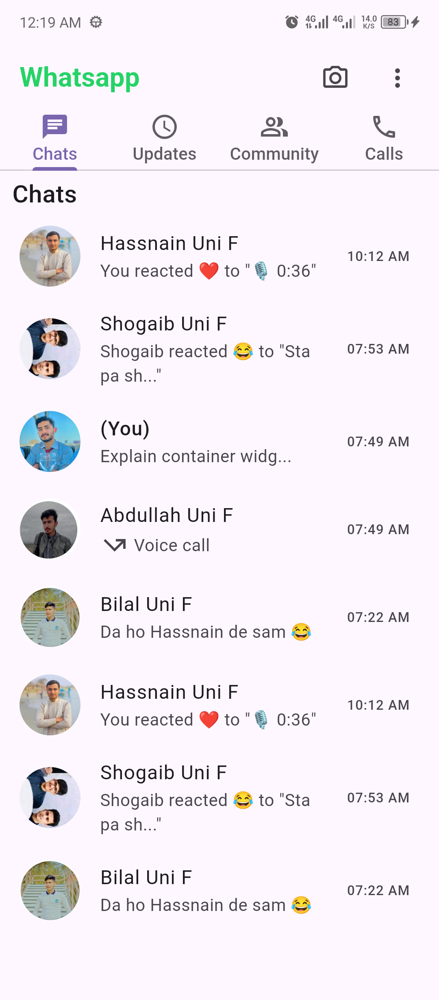
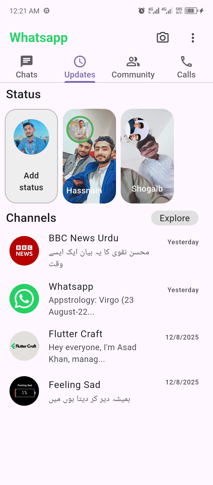
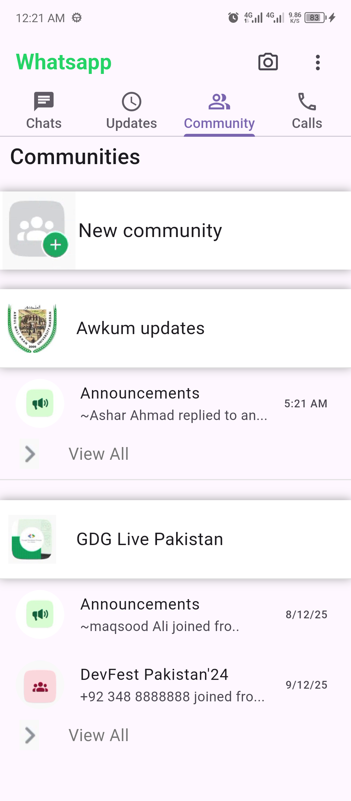
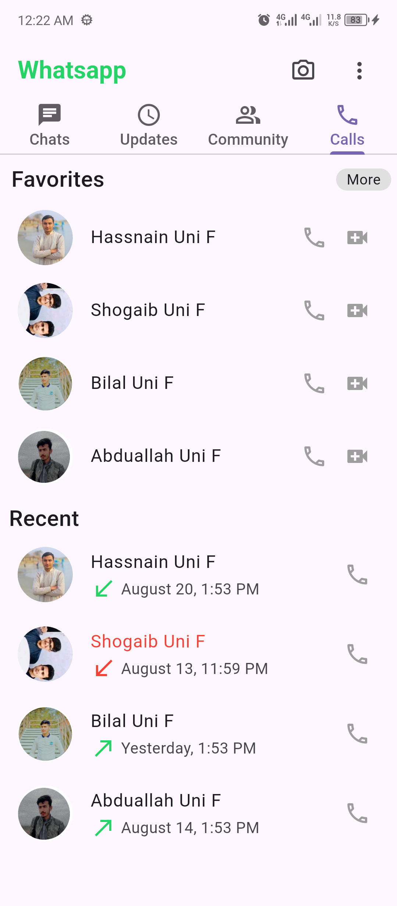

# WhatsApp Clone

A Flutter-based WhatsApp clone project that replicates the core features of the WhatsApp mobile app,
including Chats, Status Updates, Communities, and Calls tabs. This project is designed for learning 
and practicing Flutter development, focusing on UI design and navigation.

## Table of Contents
- [Description](#description)
- [Features](#features)
- [Screenshots](#screenshots)
- [Getting Started](#getting-started)
    - [Prerequisites](#prerequisites)
    - [Installation](#installation)
- [File Structure](#file-structure)


## Description
This project is a WhatsApp clone built using Flutter, showcasing a tabbed interface with four main sections: Chats, Status, Communities, and Calls. It includes a custom UI with `ListTile` widgets for chat and call lists, status boxes with background images, and a community section with announcements. The app uses Material Design components and asset images for profile pictures and status backgrounds.

## Features
- **Tabs Navigation**: Four tabs (Chats, Status, Communities, Calls) using `DefaultTabController` and `TabBar`.
- **Chats Section**: Displays a list of chat contacts with profile pictures, subtitles, and timestamps.
- **Status Section**: Includes an "Add Status" box and status updates with background images and overlaid profile pictures.
- **Communities Section**: Features community cards and announcements with profile images.
- **Calls Section**: Lists favorite and recent calls with icons for voice and video calls.
- **Custom UI**: Styled with WhatsApp's green theme and grey accents.

## Screenshots
*(Add screenshots of your app's UI here after running the app. You can use the following placeholder and replace it with actual images)*
- Chats Tab: 
- Status Tab: 
- Communities Tab: 
- Calls Tab: 

*To generate screenshots:*
1. Run the app on an emulator or physical device using `flutter run`.
2. Take screenshots and save them in a `screenshots/` folder in your repository.
3. Update the image paths above with the correct file names.

## Getting Started

### Prerequisites
- [Flutter SDK](https://flutter.dev/docs/get-started/install) installed (version 2.12.0 or later recommended).
- [Dart](https://dart.dev/get-dart) installed (included with Flutter).
- An IDE or editor (e.g., [Android Studio](https://developer.android.com/studio) or [VS Code](https://code.visualstudio.com/) with Flutter plugin).
- Git installed for version control.

### Installation
1. Clone the repository:
   ```bash
   git clone https://github.com/your-username/whatsapp-clone.git
   cd whatsapp-clone

### File Structure
whatsapp-clone/
├── assets/
│   └── images/
│       ├── hassnain_uni_f.jpeg
│       ├── shogaib_uni_f.jpeg
│       ├── deyan.jpg
│       ├── abdullah_uni_f.jpg
│       ├── bilal_uni_f.jpg
│       ├── deyan_hassnain.jpg
│       ├── deyan_shogaib.jpg
│       ├── bbc.png
│       ├── whatsapp.png
│       ├── flutter_craft.png
│       ├── feelingsad.png
│       ├── community.png
│       ├── awkum.jpeg
│       ├── gdg.png
│       ├── gdg_live.png
│       ├── announcement.png
│       └── view.png
├── lib/
│   └── main.dart
├── pubspec.yaml
└── README.md   

